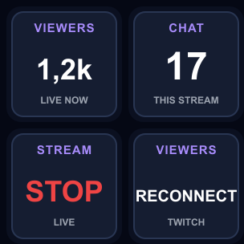

# Reynov Live Dashboard

A small personal Twitch and OBS dashboard for StreamDock devices. It was built
and tested with **MiraBox HSV293-S / firmware V2.293S.00.003**.



## What it shows

- **Viewers** — current Twitch viewer count, refreshed every 30 seconds.
- **Chat** — messages received since the current stream started.
- **Start / Stop stream** — controls OBS through OBS WebSocket 5.x.
- **OBS status** — passive connection and live-state display.
- **Stream bitrate** — estimated current OBS output bitrate.
- **Stream / recording time** — independent OBS output timers.
- **OBS health** — OBS CPU, active FPS, and skipped-frame percentage.
- **Start / Stop recording** — controls OBS recording; OBS Status shows `REC` or `LIVE+REC`.
- **Audio — Track** — one OBS input with Live + Peak or absolute Meter/Value/Status views.
- **Audio — Compare** — two tracks with Live/Peak measurement and Number/Meters/Status views.
- **Reset Audio Peaks** — clears held peaks on every audio block at once.
- **Twitch account** — connected account avatar and status dot.
- **Countdown timer** — configurable timer that continues below zero in red.
- **Moment marker** — Twitch VOD marker and/or OBS recording chapter.
- **Info Board dashboard** — compact combined view for one Information slot.

Large numbers are shortened automatically: `1000` → `1k`, `1200` → `1,2k`.

## Install from GitHub Releases

1. Open the repository's **Releases** page and download
   `streamdock-twitch-dashboard-vX.Y.Z.zip` from the latest release.
2. Close StreamDock completely.
3. Extract the archive. It contains one folder named
   `com.personal.streamdock.livedashboard.sdPlugin`.
4. Copy that whole folder to:

   ```text
   %APPDATA%\HotSpot\StreamDock\plugins\
   ```

5. Start StreamDock. Find **Twitch Live Dashboard** in the action list.

Updating works the same way: close StreamDock and replace the existing plugin
folder with the folder from the new release. Settings and OAuth tokens belong to
StreamDock's profile data and are not included in release archives.

## First-time setup

### Step 1 — Add Dashboard actions

First drag **[SETUP] Dashboard** onto one normal LCD key. Select that one action
whenever you need to connect, disconnect, diagnose, or edit Twitch/OBS. It is the
only action that contains the shared connection wizard and full-guide link.

Then drag the display/control actions you need onto existing StreamDock slots:

- normal LCD keys: **[TWITCH] Viewers**, **[TWITCH] Chat**, **[OBS] Stream**;
- HSV293-S Info Board: **Viewers**, **Chat messages**, and **OBS status**;
- optional: use **Info Board dashboard** for an all-in-one compact tile.

The HSV293-S right-side Info Board is three separate non-pressable Information
slots. A single action cannot span the whole vertical panel. Keep Start / Stop on
a normal pressable LCD key.

Metric and control actions do not repeat the connection form. Before their
dependency is configured they display `SETUP / USE SETUP`; afterwards they show
only their own status or metric.

### Step 2 — Connect Twitch

1. Select any action from this plugin to open its settings.
2. Click **Connect Twitch**. The release uses the publisher-owned Public Twitch
   application `Reynov Live Dashboard`; no developer registration or Client
   Secret is required.
3. Approve access in the browser. If no browser opens, click
   **Continue in browser** in the settings panel.

Developers can use a different Public Client ID from the collapsed **Advanced**
section. Tokens created for one Client ID cannot be reused with another;
disconnect and reconnect after changing it.

The plugin uses Twitch Device Authorization and requests `user:read:chat` plus
`channel:manage:broadcast` for Moment Marker. A Client Secret is not needed and
must never be pasted into StreamDock.

### Step 3 — Connect OBS

1. In OBS open **Tools → WebSocket Server Settings**.
2. Enable the WebSocket server and note its password.
3. In StreamDock enter:
   - URL: `ws://127.0.0.1:4455`;
   - the OBS WebSocket password.
4. Click **Save OBS settings**.

`OBS READY` means the connection is working. `OBS AUTH` means the password is
missing or incorrect. The Start / Stop action changes to `START`, `STOP`, or
`OFFLINE` according to the actual OBS state.

The setup panel displays live checkmarks for Twitch and OBS, collapses completed
steps, and can be reopened to edit settings. **Disconnect Twitch** revokes the
current token and clears the local Twitch session.

Moment Marker requires `channel:manage:broadcast`. Users connected before v0.6
must disconnect and connect Twitch once to grant this additional permission.

### Action-specific settings

The connection wizard remains exclusive to **[SETUP] Dashboard**. Actions that
genuinely need their own configuration have small focused panels:

- Audio — Track: choose one input, its Freeze option, then Live + Peak or an absolute range view;
- Audio — Compare: choose Target and Reference with separate Freeze controls, then measurement and display modes;
- Countdown Timer: set hours, minutes, and seconds;
- Moment Marker: optional description, up to 140 characters.

For voice-versus-game balance, the default status treats a target 6–12 dB above
the reference as OK, 3–6 or 12–15 dB as EDGE, and anything outside as BAD. The
numeric view shows a signed difference plus both source levels. Absolute mode
defaults to a good range of -20…-8 dBFS; both limits are editable per key.

Every focused action panel also accepts an optional custom LCD title. Empty
titles use the built-in label; long titles are shortened with `...`.

GPU usage is intentionally omitted: OBS WebSocket 5.x exposes OBS CPU, FPS, and
frame counters, but no reliable GPU-usage field.

## Verification

- Send a Twitch chat message: **Chat** should increment immediately.
- Twitch normally does not count the broadcaster as a viewer. Test **Viewers**
  with another account/device and allow one or two minutes for Twitch reporting.
- Test OBS control with a safe scene before relying on it during a real stream.

## Privacy and credentials

Twitch tokens and the OBS password are stored in StreamDock global plugin
settings on the local computer. Never publish or archive a configured plugin
profile. Release ZIP files contain code and static assets only.

## Development

Source code lives in [`live-dashboard/plugin-src`](live-dashboard/plugin-src).
The distributable plugin bundle lives in
[`live-dashboard/com.personal.streamdock.livedashboard.sdPlugin`](live-dashboard/com.personal.streamdock.livedashboard.sdPlugin).

Developer documentation:

- [Release preparation and GitHub publishing](docs/RELEASING.md)
- [Building StreamDock plugins (with a timer example)](docs/PLUGIN_DEVELOPMENT.md)

```powershell
cd live-dashboard/plugin-src
pnpm install --frozen-lockfile
pnpm test
pnpm run build
cd ../..
./scripts/package-release.ps1
```

Technical research and HSV293-S findings are in [RESEARCH.md](RESEARCH.md).
See the [privacy notice](docs/PRIVACY.md) for details about local credentials
and data processing.
